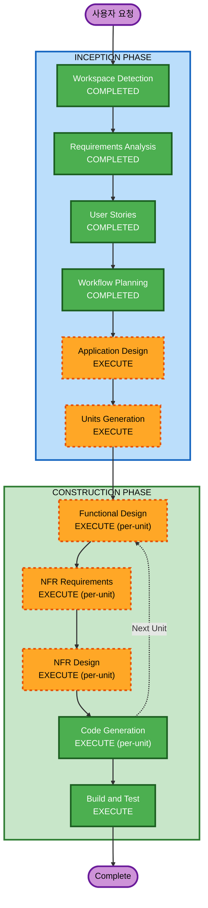

# Execution Plan - 테이블오더 서비스

## Detailed Analysis Summary

### Change Impact Assessment
- **User-facing changes**: Yes - 고객 주문 UI, 관리자 대시보드 전체 신규 개발
- **Structural changes**: Yes - 프론트엔드 2개 앱 + NestJS 백엔드 + PostgreSQL 신규 구축
- **Data model changes**: Yes - 매장, 테이블, 메뉴, 주문, 세션, 관리자 계정 등 전체 스키마 설계
- **API changes**: Yes - REST API + SSE 전체 신규 설계
- **NFR impact**: Yes - 대규모 동시 접속, 실시간 통신, 보안, 멀티테넌트 격리

### Risk Assessment
- **Risk Level**: Medium-High
- **Rollback Complexity**: Easy (Greenfield - 기존 시스템 없음)
- **Testing Complexity**: Complex (멀티테넌트, SSE, 세션 관리)

---

## Workflow Visualization



### Text Alternative
```
INCEPTION PHASE:
  1. Workspace Detection    [COMPLETED]
  2. Requirements Analysis  [COMPLETED]
  3. User Stories           [COMPLETED]
  4. Workflow Planning      [COMPLETED]
  5. Application Design    [EXECUTE]
  6. Units Generation      [EXECUTE]

CONSTRUCTION PHASE (per-unit loop):
  7. Functional Design     [EXECUTE]
  8. NFR Requirements      [EXECUTE]
  9. NFR Design            [EXECUTE]
  10. Code Generation      [EXECUTE]
  11. Build and Test       [EXECUTE]
```

---

## Phases to Execute

### INCEPTION PHASE
- [x] Workspace Detection (COMPLETED)
- [x] Requirements Analysis (COMPLETED)
- [x] User Stories (COMPLETED)
- [x] Workflow Planning (COMPLETED)
- [ ] Application Design - EXECUTE
  - **Rationale**: 신규 프로젝트로 컴포넌트 식별, 서비스 레이어 설계, 컴포넌트 간 의존성 정의 필요. 프론트엔드 2개 + 백엔드 + DB 구조의 전체 아키텍처 설계.
- [ ] Units Generation - EXECUTE
  - **Rationale**: 사용자가 4개 유닛 분리를 언급. 복잡한 시스템을 병렬 개발 가능한 유닛으로 분해 필요.

### CONSTRUCTION PHASE (per-unit)
- [ ] Functional Design - EXECUTE
  - **Rationale**: 각 유닛별 데이터 모델, 비즈니스 로직, API 엔드포인트 상세 설계 필요. 멀티테넌트 격리, 세션 관리, 주문 상태 전이 등 복잡한 비즈니스 규칙 존재.
- [ ] NFR Requirements - EXECUTE
  - **Rationale**: 대규모 동시 접속, SSE 실시간 통신, 보안 규칙 14개 적용, 멀티테넌트 데이터 격리 등 NFR 요구사항 다수.
- [ ] NFR Design - EXECUTE
  - **Rationale**: NFR Requirements에서 도출된 패턴을 구체적 설계에 반영 필요.
- [ ] Infrastructure Design - SKIP
  - **Rationale**: 로컬 서버/온프레미스 배포로 클라우드 인프라 설계 불필요. Docker Compose 등 배포 설정은 Code Generation에서 처리.
- [ ] Code Generation - EXECUTE (ALWAYS)
  - **Rationale**: 각 유닛별 코드 구현.
- [ ] Build and Test - EXECUTE (ALWAYS)
  - **Rationale**: 전체 빌드 및 테스트 지침 생성.

### OPERATIONS PHASE
- [ ] Operations - PLACEHOLDER

---

## Estimated Execution Summary

| 단계 | 유닛 수 | 예상 |
|------|---------|------|
| Application Design | 1회 | 전체 아키텍처 |
| Units Generation | 1회 | 3개 유닛 분해 |
| Functional Design | 3회 | 유닛별 |
| NFR Requirements | 3회 | 유닛별 |
| NFR Design | 3회 | 유닛별 |
| Code Generation | 3회 | 유닛별 |
| Build and Test | 1회 | 전체 통합 |

## Success Criteria
- **Primary Goal**: QR코드 기반 테이블오더 서비스 MVP 완성
- **Key Deliverables**: 고객용 React 앱, 관리자용 React 앱, NestJS 백엔드 API, PostgreSQL 스키마, SSE 실시간 통신
- **Quality Gates**: 보안 규칙 14개 준수, INVEST 기준 스토리 충족, 멀티테넌트 데이터 격리 검증

## Extension Compliance
| Extension | Status |
|-----------|--------|
| Security Baseline (SECURITY-06 제외) | Enforced - 각 단계에서 검증 |
